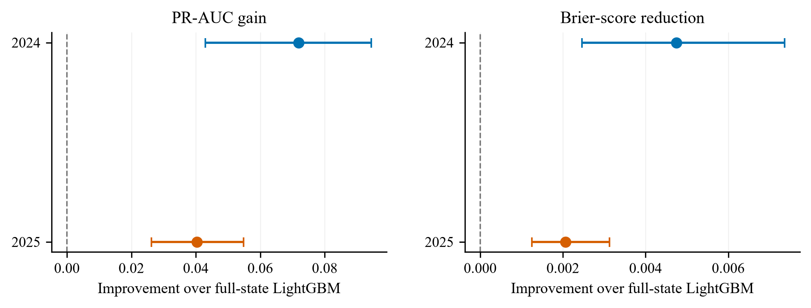

# Explainable Temporal AI for Nepal Stock Exchange (NEPSE) Surveillance

Code and processed research artefacts for **“Explainable and Calibrated
Temporal Artificial Intelligence for Rare-Event Surveillance in a Frontier
Stock Market: Rolling Evidence from Nepal.”**

The repository contains the temporal GRU, static benchmarks, rolling
evaluation, calibration, conformal prediction, block-bootstrap inference,
operational alert analysis, temporal occlusion, TreeSHAP, and explanation
randomization code.

## Repository layout

- `src/nepse_ai/`: reusable model, training, evaluation, and utility modules.
- `scripts/`: executable experiment, analysis, validation, and figure workflows.
- `configs/`: experiment settings; `results/`: compact paper evidence.
- `data/`: the processed illustrative sample only.

## Quick start

```powershell
python -m pip install -r requirements.txt
python main.py
```

Run both commands from the repository root. `main.py` validates the processed
sample and regenerates:

- `results/summary/main_result_table.csv` and `.md`;
- `results/summary/main_result_figure.png` and `.pdf`.

The table reports the locked outer-year and pooled results. The figure shows
the Temporal GRU's PR-AUC gain and Brier-score reduction relative to full-state
LightGBM, with 95% session-block bootstrap intervals.

## Headline results



| Model | 2024 PR-AUC | 2024 Brier | 2025 PR-AUC | 2025 Brier | Pooled PR-AUC | Pooled Brier |
|---|---:|---:|---:|---:|---:|---:|
| Range persistence | 0.2092 | 0.1016 | 0.1718 | 0.0922 | 0.1883 | 0.0969 |
| Logistic state | 0.2525 | 0.0987 | 0.2108 | 0.0899 | 0.2317 | 0.0942 |
| LightGBM price-liquidity | 0.2279 | 0.0994 | 0.2181 | 0.0897 | 0.2201 | 0.0945 |
| LightGBM full state | 0.2492 | 0.0974 | 0.2276 | 0.0893 | 0.2367 | 0.0933 |
| **Temporal GRU** | **0.3212** | **0.0927** | **0.2680** | **0.0872** | **0.2951** | **0.0899** |

## Data and results

No raw transaction data are included. The bundled Parquet file is a **processed
illustrative sample** of 27,476 rows, 24 securities, and 56 columns covering
2021–2025. It supports schema checks and small test runs, but it cannot
reproduce the published estimates. Replace it with the full processed
`stock_stress_labels.parquet` at the same path for full replication.

Compact metrics, bootstrap draws, explanation outputs, and the final empirical
figures are under `results/paper` and `results/figures`. Runtime logs, large
prediction files, trained checkpoints, and the manuscript's conceptual
workflow figure are excluded.

The full experiment sequence is in
`scripts/run_temporal_surveillance_experiment.sh`; final robustness checks are
in `scripts/run_robustness_checks.sh`. See `data/README.md` for sample
details.

## Licence and citation

The software code is available under the [MIT License](LICENSE) and is provided
without warranty. Reuse and redistribution must retain the copyright and
licence notice. For academic or research use, please also cite the associated
paper and software using [`CITATION.cff`](CITATION.cff). The processed sample
and third-party source material remain subject to their source providers'
applicable terms.
